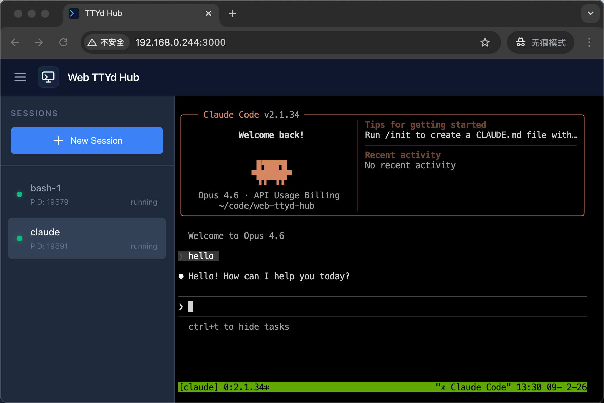

<p align="center">
  
</p>

# 🚀 Web TTYd Hub

[English](./README_EN.md)

> 🌌 把终端搬进浏览器，随时随地，打开即用。

<p align="center">
  
</p>

Web TTYd Hub 是一个基于 ttyd + tmux 的 Web 终端会话管理器。它让你在浏览器中创建、管理和切换多个终端会话，无论你在电脑前还是躺在沙发上用手机，都能拥有完整的命令行体验。

## 💡 为什么需要它

你是否有过这样的场景：

- 🏢 在公司电脑上跑着一个长任务，回到家想看看进度？
- 🛌 躺在床上突然想到一个 bug 的修复思路，想立刻打开终端验证？
- ☕️ 出门在外，只有一部手机，却想连上家里的开发机写代码？

**Web TTYd Hub** 就是为此而生。它把你的终端变成一个 Web 服务，打开浏览器就能用，会话永不丢失。

## ✨ 特性

- **🧩 多会话管理** — 创建多个独立的终端会话，自由切换，互不干扰
- **💾 会话持久化** — 基于 tmux，关闭浏览器会话依然存活，随时重新连接
- **👥 多人协作** — 多个浏览器可同时连接同一会话，实时共享终端画面
- **🐚 多 Shell 支持** — 支持 Bash、Zsh、Fish 等，创建会话时自由选择
- **📱 移动端友好** — 响应式界面，手机平板均可流畅操作
- **🎨 深色科技感 UI** — 精致的 Slate 深色主题、毛玻璃效果、流畅动画，赏心悦目
- **⚡️ 零配置启动** — 安装依赖后一条命令启动，开箱即用

## 🔮 Vibe Coding：从移动端开始编程

Web TTYd Hub 天然适合 **Vibe Coding** 工作流。

搭配 Claude Code、Cursor 等 AI 编程工具，你可以在手机上通过终端与 AI 对话式编程——描述需求、审查代码、运行测试，整个开发流程都可以在移动端完成。通勤路上、咖啡馆里、甚至排队等餐时，灵感来了随时开工。

tmux 会话保证了连续性：手机上开始的工作，回到电脑前无缝继续，不丢失任何上下文。

## 🌐 搭配 Asterism 实现内网穿透

如果你的开发机在家庭或公司内网中，可以搭配 [Asterism](https://github.com/sosopop/asterism) 实现内网穿透，从任何地方访问你的终端。

Asterism 是一个轻量级的内网穿透工具，纯 C 实现，单文件可执行，跨平台支持（Windows / Linux / macOS / Android / iOS），性能优异，资源占用极低。

**典型部署方式：**

```
手机/平板浏览器 📱
    ↓
公网服务器 (Asterism Server) ☁️
    ↓ 内网穿透隧道 🚇
内网开发机 (Web TTYd Hub + Asterism Client) 💻
```

这样你就拥有了一个随身携带的云开发环境——只要有网络，就能连上你的终端。

## 🛠 环境要求

- **Node.js** >= 18
- **ttyd** — Web 终端模拟器
- **tmux** — 终端复用器

### macOS 安装依赖

```bash
brew install ttyd tmux
```

## 🚀 快速开始

```bash
# 安装依赖
npm install
cd frontend && npm install && cd ..

# 构建前端
npm run build

# 启动服务
npm start
```

浏览器打开 `http://localhost:3000` 即可使用。

## 👨‍💻 开发模式

```bash
npm run dev
```

同时启动后端（端口 3000）和 Vite 开发服务器（端口 5173）。

## ⚙️ 配置项

通过环境变量或 `.env` 文件设置：

| 变量                    | 说明              | 默认值    |
| ----------------------- | ----------------- | --------- |
| `PORT`                  | 服务监听端口      | `3000`    |
| `HOST`                  | 监听地址          | `0.0.0.0` |
| `TTYD_PORT_RANGE_START` | ttyd 端口范围起始 | `7681`    |
| `TTYD_PORT_RANGE_END`   | ttyd 端口范围结束 | `7780`    |

## 📄 License

MIT
